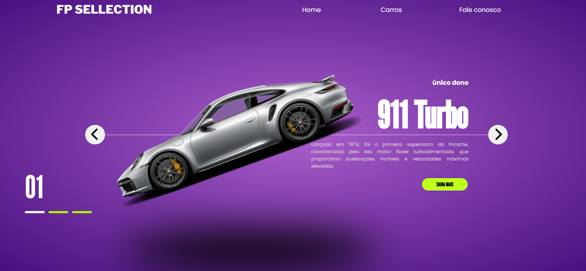

# 🚗 FP Selection – Site de Carros  

Um site simples que apresenta carros de luxo, desenvolvido com **HTML5, CSS3 e JavaScript**.  
Projeto criado como parte dos meus estudos, focado em **estrutura semântica, estilização e interatividade**.  

---

## 🔥 Funcionalidades
- Navegação entre carros com botões interativos  
- Destaque visual com imagens e descrições  
- Layout moderno com cores vibrantes  
- Estrutura organizada em HTML, CSS e JavaScript  

---

## 🛠 Tecnologias Utilizadas
- HTML5  
- CSS3  
- JavaScript  

---

## 📸 Demonstração
  
*(imagem de preview do site)*  

---

## 🌍 Acesse o Projeto Online
👉 [Clique aqui para ver o site rodando](https://thainar4.github.io/carros-site/)  

## 📌 Próximos Passos
- Tornar o site responsivo 📱
- Adicionar mais carros 🚙
- Melhorar animações ✨
